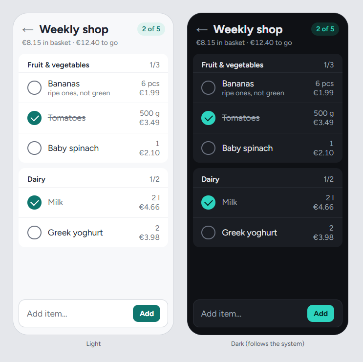
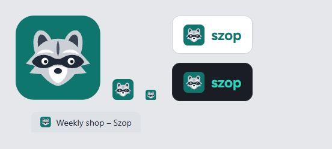
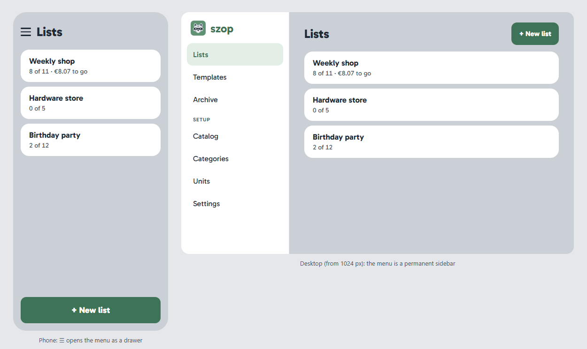

# Szop — Visual Design

Living description of what Szop looks like and how its screens are built: the look, the components and styling, the design tokens, the brand, and the layout and interaction principles every phase follows. The decisions behind it, with the alternatives considered, are in [ADR 0013](../decisions/0013-visual-design.md); the non-functional requirements it serves are [NFR-1](../requirements/functional-requirements.md#nfr-1) (browsers), [NFR-2](../requirements/functional-requirements.md#nfr-2) (accessibility) and [NFR-3](../requirements/functional-requirements.md#nfr-3) (performance). Acronyms are explained in the [glossary](../glossary.md).

This page describes the design system, not the screens: each phase designs the screens it builds ([ADR 0004](../decisions/0004-implementation-process.md), decision 4) and updates this page when it changes the system. **The pictures here are mockups drawn during the brainstorm**: the decisions (tokens, font, layout) are binding, the pixel details are illustrations.

## Contents

- [1. The look](#1-the-look)
- [2. Components and styling](#2-components-and-styling)
  - [Under the Content Security Policy](#under-the-content-security-policy)
- [3. Design tokens](#3-design-tokens)
  - [Color](#color)
  - [Dark mode](#dark-mode)
  - [Typography](#typography)
  - [Spacing, size, shape and motion](#spacing-size-shape-and-motion)
- [4. Icons and brand](#4-icons-and-brand)
- [5. Layout and navigation](#5-layout-and-navigation)
- [6. Interaction patterns](#6-interaction-patterns)
  - [Feedback](#feedback)
  - [Forms and focus](#forms-and-focus)
  - [Writing](#writing)
- [7. How a phase designs its screens](#7-how-a-phase-designs-its-screens)

## 1. The look

**Calm and roomy**: the calm of Todoist, one accent color and plenty of white space, with the large tap targets of a shopping app such as Bring!. Category sections are soft white cards on a light gray page; rows are 56 px high with large round checkboxes; checked items are struck through and muted; color is used sparingly.

## 2. Components and styling

- **[shadcn/ui](https://ui.shadcn.com/) on [Base UI](https://base-ui.com/).** shadcn's command-line tool copies styled component source into `apps/web/src/components/ui/`; the code is ours to read and change. Components are added one by one as phases need them, never all up front. Base UI underneath provides the behavior and accessibility: focus handling, keyboard use, dialogs, menus and toasts.
- **[Tailwind CSS](https://tailwindcss.com/) v4**, through `@tailwindcss/vite`, configured in CSS. Utility classes (`px-4 min-h-14 border-t`) are compiled at build time into one stylesheet holding only the classes used. Long class lists live inside components, not on pages.
- **shadcn's `cn()` helper** merges class lists without conflicts. **`prettier-plugin-tailwindcss`** keeps class order consistent, and the **Tailwind CSS IntelliSense** extension completes classes in VS Code.
- **[Lucide](https://lucide.dev/)** for icons (see [section 4](#4-icons-and-brand)).

### Under the Content Security Policy

The CSP ([ADR 0012](../decisions/0012-security-baseline.md), decision 8) allows no `<style>` elements, so every style must come from the built stylesheet:

- Base UI's `CSPProvider` is set with **`disableStyleElements`**; the CSS it would inject (hiding native scrollbars in scroll areas and selects) is in our stylesheet instead.
- **Toasts use Base UI's Toast**, not Sonner, shadcn's default, which injects a `<style>` element.
- **Setting styles through the DOM** (React's `style` prop, `element.style`) is allowed and stays usable for dynamic values.
- **Every E2E journey fails on a CSP violation**, so a library that injects styles is caught the first time a test opens it. Check a new library for injected styles before adopting it.

## 3. Design tokens

Tokens are CSS custom properties in two tiers. **The palette** is Tailwind's built-in colors; **semantic roles** point into it, and components use only the roles (`bg-primary`, `text-muted-foreground`), never a raw color. A new brand color, dark mode or a future theme then changes tokens only. The roles are shadcn/ui's, plus `warning`; a phase adds a role when it needs one and records it here.

### Color

The accent is **teal**; neutrals come from Tailwind's **`gray`**. Starting values, set and checked by the first UI phase:

| Role | Used for | Light | Dark |
|---|---|---|---|
| `background` / `foreground` | The page and its text | `gray-50` / `gray-900` | `gray-950` / `gray-100` |
| `card` | Category sections, list cards, the sidebar | `white` | `gray-900` |
| `muted-foreground` | Secondary text: notes, counts, prices | `gray-500` | `gray-400` |
| `border` | Dividers between rows | `gray-200` | `gray-800` |
| `input` | Borders of checkboxes and inputs | `gray-500` | `gray-500` |
| `primary` / `primary-foreground` | Checked items, the main button, the active menu entry | `teal-700` / `white` | `teal-400` / `teal-950` |
| `accent` | Soft highlights: the progress pill, the active menu entry's background | `teal-100` | `teal-950` |
| `ring` | The focus ring | `teal-700` | `teal-400` |
| `destructive` | Deleting | `red-600` | `red-400` |
| `warning` | The offline banner ([NET-1](../requirements/functional-requirements.md#net-1)) | `amber-100` with `amber-900` text | `amber-950` with `amber-200` text |

**Contrast:** every text pair meets 4.5:1 and every UI part (checkbox borders, the focus ring) 3:1 against its background, in both schemes ([NFR-2](../requirements/functional-requirements.md#nfr-2)). `gray-400` borders on white are only about 2.5:1, which is why `input` is `gray-500`. axe checks every page in light and dark.

### Dark mode

Dark mode **follows the system setting** (`prefers-color-scheme`) through Tailwind's `dark:` variant, with no JavaScript. There is no manual toggle; it is a 💡 [future extension](../requirements/functional-requirements.md#future-extensions-ideas-not-committed). Adding it later means switching `dark:` to a class on `<html>`, a small theme script loaded before the page paints (a separate file, since the CSP forbids inline scripts), a menu and two tests; components do not change.

### Typography

- **[Figtree](https://fontsource.org/fonts/figtree)**, self-hosted from `@fontsource-variable/figtree`: one variable font for every weight, 20 KB for Latin and 10 KB for Latin Extended (downloaded only when a character needs it, such as a Polish product name). Bundled by Vite and served from our origin; `font-display: swap`, with the system font as the fallback.
- **Tailwind's default type scale.** Item names and inputs are 16 px (`text-base`); nothing is smaller than 12 px (`text-xs`). Weights 400, 600 and 700.
- **Tabular figures** (`tabular-nums`) for quantities, prices and totals, so they line up in columns.

### Spacing, size, shape and motion

| Token | Value |
|---|---|
| Spacing | Tailwind's 4 px grid |
| Tap targets | At least 48 px for anything tappable; list rows 56 px |
| `--radius` | 12 px for cards, buttons and inputs; checkboxes and pills fully round |
| Elevation | Flat; one shadow level, only for floating elements (dialogs, menus, toasts) |
| Motion | 150–200 ms for checking items off and opening dialogs; none when the system asks for reduced motion (`motion-safe:`) |

## 4. Icons and brand

- **Icons:** Lucide's line icons, imported one by one as React components, so only the icons used reach the bundle.
- **The brand mark** is a **flat raccoon** on a teal rounded square: *szop* is Polish for raccoon. It is drawn around a solid eye mask with white brows, a white muzzle, rounded ears and cheek ruffs, which keep it recognizable at 16 px. The approved draft is [`raccoon.svg`](visual-design/raccoon.svg); the first UI phase polishes it into the favicon and the header logo.
- **The wordmark** is "szop" in lowercase Figtree Bold, `teal-700` (`teal-400` in dark mode), next to the mark.

## 5. Layout and navigation

- **Mobile first.** Styles are written for the phone; wider screens add to them, using Tailwind's default breakpoints.
- **The lists are the home screen.** Everything else (templates, archive, catalog, categories, units, settings) is in one menu: **a drawer opened from ☰ on phones, a permanent sidebar from `lg` (1024 px)**, with the setup screens grouped under their own heading.
- **Inside a list**, the menu gives way to a back arrow, and the add bar sits at the bottom.
- **Desktop content is at most about 720 px wide**, so rows don't stretch across a wide screen.
- **On phones, a screen's main action** ("New list", the add bar) **is pinned at the bottom**, within thumb reach. Sticky bars never cover the focused element.

## 6. Interaction patterns

### Feedback

- **Changes are optimistic**: checking, adding and editing show at once, with no spinner; a failure rolls the change back and says so ([architecture](architecture.md#optimistic-updates)).
- **Messages are toasts** (Base UI Toast) that say what happened and what to do. Never a generic "Something went wrong"; limits explain themselves ([LIM-3](../requirements/functional-requirements.md#lim-3), [LIM-4](../requirements/functional-requirements.md#lim-4)).
- **Undo rather than "Are you sure?"** for reversible actions; a confirmation dialog only for what cannot be undone, such as deleting an account. Which actions get undo is decided by their phases ([OP-051](../open-points.md#op-051)).
- **Loading:** skeleton placeholders shaped like the content on a page's first load, never a full-screen spinner.
- **Empty states:** every empty page says what it is for and offers the next action ("No lists yet" with "New list"). An illustration is optional.
- **Offline ([NET-1](../requirements/functional-requirements.md#net-1)):** an amber `warning` banner stays at the top while offline; controls that change data are disabled with a visible reason.

### Forms and focus

- **Labels are always visible**, never placeholder-only. Errors appear under their field, in words, checked when leaving the field and on submit.
- **A visible focus ring** (`ring`) on everything focusable. Dialogs and drawers trap focus and return it when closed (Base UI does this).

### Writing

Plain, friendly, short English in **sentence case**: "New list", not "Create New List".

## 7. How a phase designs its screens

1. **The phase brainstorm designs its screens as mockups** in the visual companion, using the tokens on this page.
2. **The approved mockups are committed as screenshots**, phone and desktop, in a folder next to the phase's spec (for example `docs/superpowers/specs/2026-11-02-lists/`), and the spec links them. The companion's own files in `.superpowers/` are not kept.
3. **The spec lists each screen's states:** empty, loading, error, offline, long content (a 40-character product name) and dark mode.
4. **The PR shows screenshots of what was built**: phone in light and dark, desktop in light ([definition of done](../development/definition-of-done.md), item 11).
5. **This page is updated** when the phase adds a token, a role, a pattern or a component convention.
