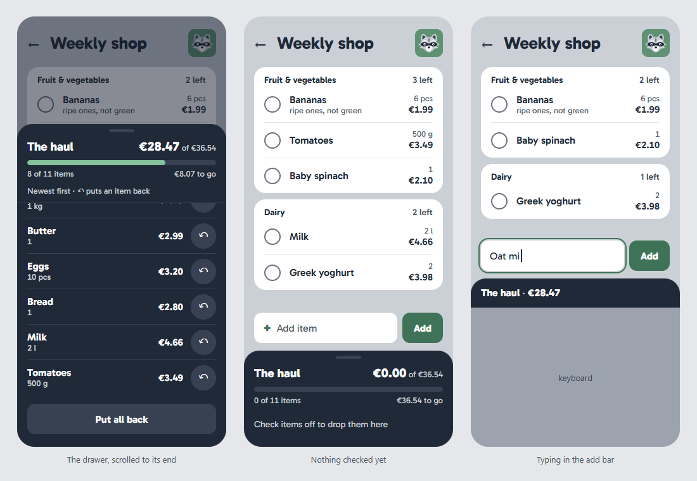

# Szop — Visual Design

Living description of what Szop looks like and how its screens are built: the look, the components and styling, the design tokens, the brand, and the layout and interaction principles every phase follows. The decisions behind it, with the alternatives considered, are in [ADR 0013](../decisions/0013-visual-design.md) and [ADR 0022](../decisions/0022-ring-tail-redesign.md), which replaced its look, color and font; the non-functional requirements it serves are [NFR-1](../requirements/functional-requirements.md#nfr-1) (browsers), [NFR-2](../requirements/functional-requirements.md#nfr-2) (accessibility) and [NFR-3](../requirements/functional-requirements.md#nfr-3) (performance). Acronyms are explained in the [glossary](../glossary.md).

This page describes the design system, not the screens: each phase designs the screens it builds ([ADR 0004](../decisions/0004-implementation-process.md), decision 4) and updates this page when it changes the system. **The pictures here are mockups drawn during the brainstorm**: the decisions (tokens, font, layout) are binding, the pixel details are illustrations.

## Contents

- [1. The look](#1-the-look)
- [2. Components and styling](#2-components-and-styling)
  - [Under the Content Security Policy](#under-the-content-security-policy)
- [3. Design tokens](#3-design-tokens)
  - [Color](#color)
  - [Dark mode](#dark-mode)
  - [Typography](#typography)
  - [Spacing, size, shape and motion](#spacing-size-shape-and-motion)
- [4. Icons and brand](#4-icons-and-brand)
- [5. Layout and navigation](#5-layout-and-navigation)
  - [The list and the haul](#the-list-and-the-haul)
- [6. Interaction patterns](#6-interaction-patterns)
  - [Feedback](#feedback)
  - [Forms and focus](#forms-and-focus)
  - [Writing](#writing)
- [7. How a phase designs its screens](#7-how-a-phase-designs-its-screens)

## 1. The look

**Ring tail**: a fur-gray page holds white, generously rounded category cards, and a dark tray at the bottom, **the haul**, collects what is already in the basket ([The list and the haul](#the-list-and-the-haul)). Sage is the one accent, and color is used sparingly. Rows are 56 px high with large round checkboxes, for one hand on a phone in a store. The look comes from a design exploration ([its screenshot](../ideas/visual-design/ring-tail.png)), adjusted in [ADR 0022](../decisions/0022-ring-tail-redesign.md).

## 2. Components and styling

- **[shadcn/ui](https://ui.shadcn.com/) on [Base UI](https://base-ui.com/).** shadcn's command-line tool copies styled component source into `apps/web/src/components/ui/`; the code is ours to read and change. Components are added one by one as phases need them, never all up front. Base UI underneath provides the behavior and accessibility: focus handling, keyboard use, dialogs, menus and toasts.
- **[Tailwind CSS](https://tailwindcss.com/) v4**, through `@tailwindcss/vite`, configured in CSS. Utility classes (`px-4 min-h-14 border-t`) are compiled at build time into one stylesheet holding only the classes used. Long class lists live inside components, not on pages.
- **shadcn's `cn()` helper** merges class lists without conflicts. **`prettier-plugin-tailwindcss`** keeps class order consistent, and the **Tailwind CSS IntelliSense** extension completes classes in VS Code.
- **[Lucide](https://lucide.dev/)** for icons (see [section 4](#4-icons-and-brand)).

### Under the Content Security Policy

The CSP ([ADR 0012](../decisions/0012-security-baseline.md), decision 8) allows no `<style>` elements, so every style must come from the built stylesheet:

- Base UI's `CSPProvider` is set with **`disableStyleElements`**; the CSS it would inject (hiding native scrollbars in scroll areas and selects) is in our stylesheet instead.
- **Toasts use Base UI's Toast**, not Sonner, shadcn's default, which injects a `<style>` element.
- **Setting styles through the DOM** (React's `style` prop, `element.style`) is allowed and stays usable for dynamic values.
- **Every E2E journey fails on a CSP violation**, so a library that injects styles is caught the first time a test opens it. Check a new library for injected styles before adopting it.

## 3. Design tokens

Tokens are CSS custom properties in two tiers. **The palette** is Tailwind's built-in colors plus two of Szop's own, `fur` and `sage`; **semantic roles** point into it, and components use only the roles (`bg-primary`, `text-muted-foreground`), never a raw color. A new brand color, dark mode or a future theme then changes tokens only. The roles are shadcn/ui's, plus `warning` and the `haul-*` roles of the haul; a phase adds a role when it needs one and records it here.

### Color

The accent is **sage**; neutrals come from Tailwind's **`gray`**, and the light page is **`fur`**. The two custom colors, defined next to Tailwind's palette:

- **`fur`**: `#CBD0D6`.
- **`sage`**, only the steps used: `sage-100 #E3EEE7`, `sage-300 #86C29C`, `sage-500 #5F9273` (the logo's tile), `sage-700 #3F7357`, `sage-950 #10261A`. A phase that needs another step adds it here and checks its contrast.

| Role | Used for | Light | Dark |
|---|---|---|---|
| `background` / `foreground` | The page and its text | `fur` / `gray-800` | `gray-900` / `gray-200` |
| `card` | Category cards, inputs on the page, the sidebar | `white` | `gray-800` |
| `muted-foreground` | Secondary text: notes, counts, prices | `gray-600` | `gray-400` |
| `border` | Dividers between rows | `gray-200` | `gray-700` |
| `input` | Borders of checkboxes and inputs | `gray-500` | `gray-400` |
| `primary` / `primary-foreground` | The main button, the active menu entry's text | `sage-700` / `white` | `sage-300` / `sage-950` |
| `accent` | The active menu entry's background | `sage-100` | `sage-950` |
| `ring` | The focus ring | `sage-700` | `sage-300` |
| `haul` / `haul-foreground` | The haul tray and drawer, and their text | `gray-800` / `white` | `gray-950` / `white` |
| `haul-muted` | Secondary text in the haul: prices, the caption | `fur` | `gray-400` |
| `haul-chip` | Chips, the ↶ buttons, the progress bar's track, the handle | `gray-700` | `gray-800` |
| `haul-accent` | The progress fill, the focus ring inside the haul | `sage-300` | `sage-300` |
| `destructive` | Deleting | `red-600` | `red-400` |
| `warning` | The offline banner ([NET-1](../requirements/functional-requirements.md#net-1)) | `amber-100` with `amber-900` text | `amber-950` with `amber-200` text |

**Contrast:** every text pair meets 4.5:1 and every UI part (checkbox borders, the focus ring, the progress fill) 3:1 against its background, in both schemes ([NFR-2](../requirements/functional-requirements.md#nfr-2)). The narrowest are `primary` on `accent` (4.6:1) and the focus ring on the fur page (3.6:1); every pair is listed in the [redesign spec](../superpowers/specs/2026-10-07-ring-tail-redesign-design.md#contrast). `gray-400` borders on white are only about 2.5:1, which is why `input` is `gray-500` in light mode. axe checks every page in light and dark.

### Dark mode

Dark mode **follows the system setting** (`prefers-color-scheme`) through Tailwind's `dark:` variant, with no JavaScript. There is no manual toggle; it is a 💡 [future extension](../requirements/functional-requirements.md#future-extensions-ideas-not-committed). Adding it later means switching `dark:` to a class on `<html>`, a small theme script loaded before the page paints (a separate file, since the CSP forbids inline scripts), a menu and two tests; components do not change. **The haul stays the darkest surface in both schemes**: `gray-800` on the fur page in light mode, `gray-950` on the `gray-900` page in dark mode, so the screen keeps its shape.

### Typography

- **[Gabarito](https://fontsource.org/fonts/gabarito)**, self-hosted from `@fontsource-variable/gabarito`, under the SIL Open Font License (OFL): one variable font for every weight, 36 KB for Latin, with Latin Extended downloaded only when a character needs it, such as a Polish product name. Bundled by Vite and served from our origin; `font-display: swap`, with the system font as the fallback.
- **Tailwind's default type scale.** Item names and inputs are 16 px (`text-base`); nothing is smaller than 12 px (`text-xs`). Weights 400, 600, 700 and 800; 800 is for the screen title and the haul's amount.
- **Tabular figures** (`tabular-nums`) for quantities, prices and totals, so they line up in columns.

### Spacing, size, shape and motion

| Token | Value |
|---|---|
| Spacing | Tailwind's 4 px grid |
| Tap targets | At least 48 px for anything tappable; list rows 56 px |
| `--radius` | 12 px for buttons and inputs; checkboxes, chips and pills fully round |
| `--radius-surface` | 18 px for category cards; 24 px for the top corners of the haul and its drawer |
| Elevation | Flat; one shadow level, only for floating elements (dialogs, menus, toasts) |
| Motion | 150–200 ms for checking items off and opening dialogs; none when the system asks for reduced motion (`motion-safe:`) |

## 4. Icons and brand

- **Icons:** Lucide's line icons, imported one by one as React components, so only the icons used reach the bundle.
- **The brand mark** is a **flat raccoon** on a sage rounded square (`sage-500`): *szop* is Polish for raccoon. It is drawn around a solid eye mask with white brows, a white muzzle, rounded ears and cheek ruffs, which keep it recognizable at 16 px. The approved draft is [`raccoon.svg`](visual-design/raccoon.svg); the first UI phase polishes it into the favicon and the header logo.
- **The wordmark** is "szop" in lowercase Gabarito Bold, `sage-700` (`sage-300` in dark mode), next to the mark. On the list screen the mark alone sits at the right of the header.

## 5. Layout and navigation

- **Mobile first.** Styles are written for the phone; wider screens add to them, using Tailwind's default breakpoints.
- **The lists are the home screen.** Everything else (templates, archive, catalog, categories, units, settings) is in one menu: **a drawer opened from ☰ on phones, a permanent sidebar from `lg` (1024 px)**, with the setup screens grouped under their own heading.
- **Inside a list**, the menu gives way to a back arrow, and the add bar and the haul sit at the bottom ([below](#the-list-and-the-haul)).
- **Desktop content is at most about 720 px wide**, so rows don't stretch across a wide screen.
- **On phones, a screen's main action** ("New list", the add bar) **is pinned at the bottom**, within thumb reach. Sticky bars never cover the focused element.

### The list and the haul

The main screen's pattern, decided in [ADR 0022](../decisions/0022-ring-tail-redesign.md), decisions 3 to 8: **checked items leave the list and drop into the haul**, a dark tray at the bottom, so the list shows only what is left. The list phases build it and design their screens on top of it.

From top to bottom, on a phone:

1. **Header**: ← back, the list's name (Gabarito 800, cut with "…" when too long), the raccoon tile. List actions (rename, sort setting and so on) are placed by the phases that add them.
2. **Category cards with the unchecked items only**, ordered as [ORD-2](../requirements/functional-requirements.md#ord-2) and [ORD-3](../requirements/functional-requirements.md#ord-3) say. The card's header shows the category and "N left". A card disappears when all its items are checked.
3. **The add bar**, pinned above the haul, on the page: a white field "+ Add item" and a sage "Add" button. While the field has focus, the haul folds to one line ("The haul · €28.47"), so the keyboard leaves room for the list.
4. **The collapsed haul**, a dark tray with rounded top corners and a fixed height:
   - a handle;
   - "The haul" and the amount, "€28.47 of €36.54";
   - the progress bar, with "8 of 11 items" and "€8.07 to go" under it;
   - **one row of chips, most recently checked first**, as many as fit, then "+N more". A chip shows the name and the line total, or the name alone without a price. **Tapping a chip puts the item back** in the list.
5. **The drawer**, the haul pulled up to **75% of the screen's height**:
   - opened by dragging the handle up, tapping the haul's header or tapping "+N more"; closed by dragging it down, tapping the dimmed list or pressing Esc;
   - the list behind it is dimmed; the drawer traps focus while open and returns it when closed;
   - **the header stays pinned**: handle, amount, bar and caption, as in the collapsed haul;
   - then "Newest first · ↶ puts an item back", and **rows**: name, quantity and unit, line total and a **↶ button**. Only the button puts an item back; the row itself does nothing;
   - at the end, a **"Put all back"** button: [LST-5](../requirements/functional-requirements.md#lst-5)'s "Uncheck all".

**Checking an item**: its row leaves its card and its chip appears first in the haul, in 150 to 200 ms, without motion when the system asks for reduced motion. Putting an item back reverses it: the item returns to its place in its card.

**Amounts.** The haul shows all three totals of [ITM-8](../requirements/functional-requirements.md#itm-8):

- **"€28.47"**: the checked items;
- **"of €36.54"**: all items;
- **"€8.07 to go"**: the unchecked items.

Items without a price are left out of all three. When no item has a price, the money is not shown, and the header keeps the count ("8 of 11 items"). The progress bar always follows the count of items, not the money.

**Desktop.** The same pattern inside the content column of at most 720 px, next to the sidebar from `lg`: the add bar and the haul are pinned at the bottom of the column, and the drawer covers 75% of the window's height, within the column. One row of chips holds more chips.

**States:**

| State | List area | Haul |
|---|---|---|
| Loading | Skeleton cards | A skeleton header |
| Empty list | "Nothing on this list yet", pointing at the add bar | Hidden |
| Nothing checked yet | The cards | Header with an empty bar; "Check items off to drop them here" instead of chips |
| Everything checked | "Everything's in the haul" | Unchanged |
| Long names | Rows wrap to two lines | Chips cut with "…" at about 12 characters; drawer rows wrap |
| Offline | The amber banner at the top; checkboxes disabled with a reason | Chips, ↶ and "Put all back" disabled |
| Dark mode | `gray-900` page, `gray-800` cards | `gray-950`, the darkest surface |

## 6. Interaction patterns

### Feedback

- **Changes are optimistic**: checking, adding and editing show at once, with no spinner; a failure rolls the change back and says so ([architecture](architecture.md#optimistic-updates)).
- **Messages are toasts** (Base UI Toast) that say what happened and what to do. Never a generic "Something went wrong"; limits explain themselves ([LIM-3](../requirements/functional-requirements.md#lim-3), [LIM-4](../requirements/functional-requirements.md#lim-4)).
- **Undo rather than "Are you sure?"** for reversible actions; a confirmation dialog only for what cannot be undone, such as deleting an account. Which actions get undo is decided by their phases ([OP-051](../open-points.md#op-051)).
- **Loading:** skeleton placeholders shaped like the content on a page's first load, never a full-screen spinner.
- **Empty states:** every empty page says what it is for and offers the next action ("No lists yet" with "New list"). An illustration is optional.
- **Offline ([NET-1](../requirements/functional-requirements.md#net-1)):** an amber `warning` banner stays at the top while offline; controls that change data are disabled with a visible reason.

### Forms and focus

- **Labels are always visible**, never placeholder-only. The one exception is the list's add bar, which works like a search field: its accessible name says which list it adds to, and its button says "Add" ([ADR 0022](../decisions/0022-ring-tail-redesign.md), decision 13). Errors appear under their field, in words, checked when leaving the field and on submit.
- **A visible focus ring** (`ring`) on everything focusable. Dialogs and drawers trap focus and return it when closed (Base UI does this).

### Writing

Plain, friendly, short English in **sentence case**: "New list", not "Create New List".

## 7. How a phase designs its screens

1. **The phase brainstorm designs its screens as mockups** in the visual companion, using the tokens on this page.
2. **The approved mockups are committed as screenshots**, phone and desktop, in a folder next to the phase's spec (for example `docs/superpowers/specs/2026-11-02-lists/`), and the spec links them. The companion's own files in `.superpowers/` are not kept.
3. **The spec lists each screen's states:** empty, loading, error, offline, long content (a 40-character product name) and dark mode.
4. **The PR shows screenshots of what was built**: phone in light and dark, desktop in light ([definition of done](../development/definition-of-done.md), item 11).
5. **This page is updated** when the phase adds a token, a role, a pattern or a component convention.
